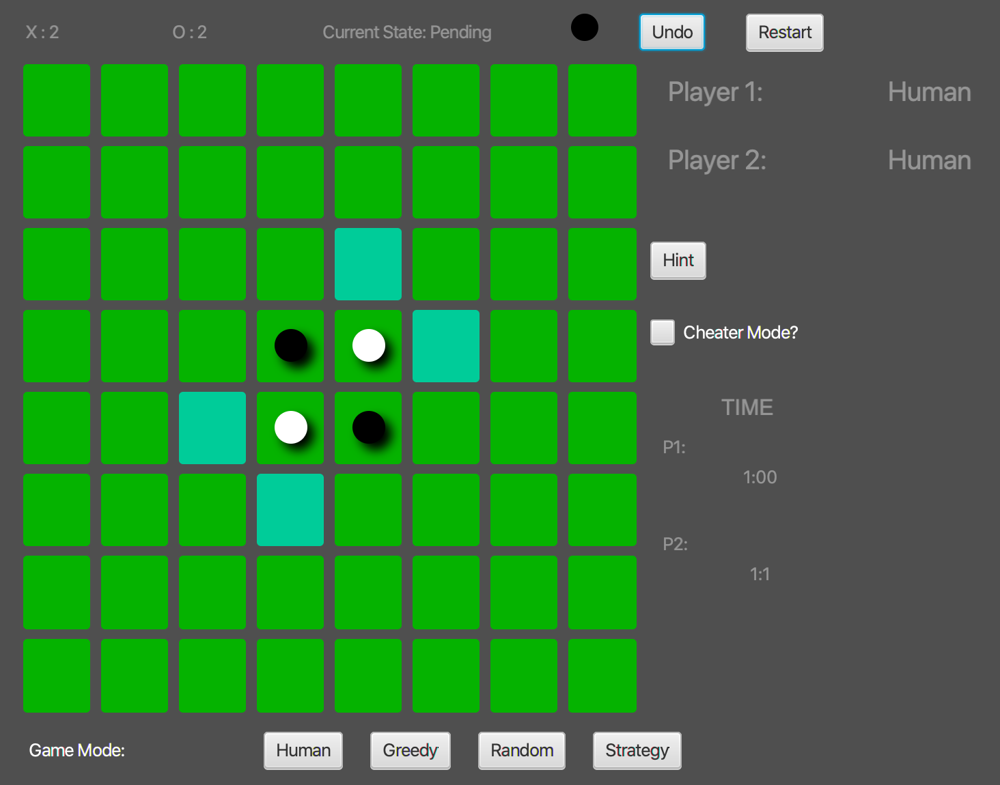

# Othello
A game classic game given a mordern touch

# Motivation
Growing up in an age of classics games. I have always had a soft spot for them. From Burnout to God Of War, I lost touch of these games. To bring back there charm I wanted to create othello with a mordern touch.

<p align="center">

</p>

# Getting Started
## File Structure
```
    .
    ├── out              # Compiled files (alternatively `dist`)
    ├── src              # Source files (alternatively `lib` or `app`)
    ├── rest files for IntelliJ configuration
    └── README.md
```

## Prerequisite
As the code is written in Java you need to install Java. If you don't already have it on your computer you can download it from <a href="https://www.java.com/en/download/">here</a>

To run the game on an IDE/Java Enviornment you can start from "othelloApplication.java".

# Contributions
All developers are encouraged to not only install the game and give it a run try to beat all the AIs. You cannot copy or modify the code for any purposes. However if you email me on <a href="mailto:milindvishnoi@gmail.com">milindvishnoi@gmail.com</a> for more any bugs or improvements you may want.

# License
 This code is provided solely for the personal and private use of students taking the CSC207H5 course at the University of Toronto. Copying for purposes other than this use is expressly prohibited.All forms of distribution of this code, whether as given or with any changes, are expressly prohitbited.
 Authors: Arnold Rosenbloom, Gautam Gireesh, Arjun Ganguly, Parshva, Milind Vishnoi
 All of the files in this directory and all subdirectories are:
 Copyright (c) 2019 Arnold Rosenbloom.

# Authors
- Arnorld Rosenbloom
- Gautam Gireesh
- Arjun Ganguly
- Parshva 
- Milind Vishnoi

[Back To Top](#Othello)